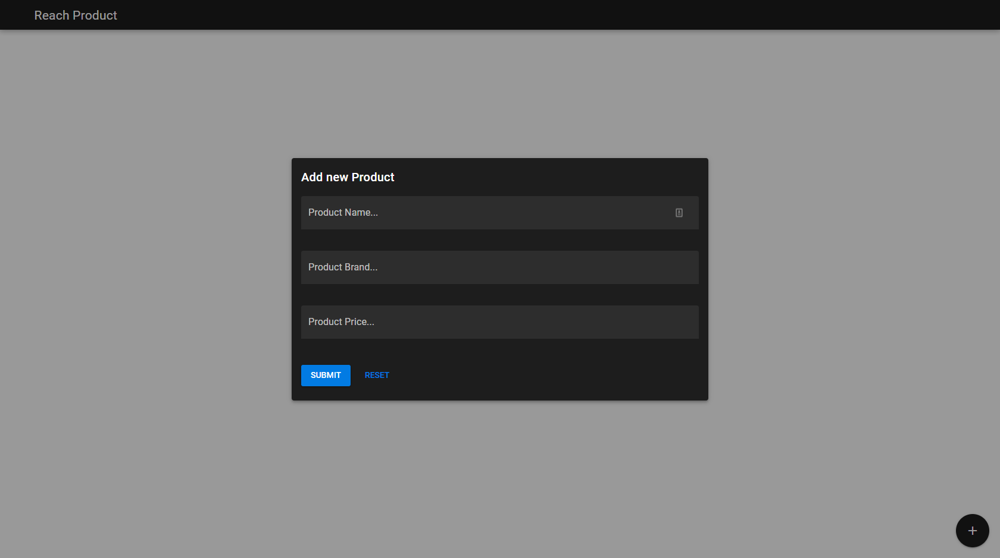
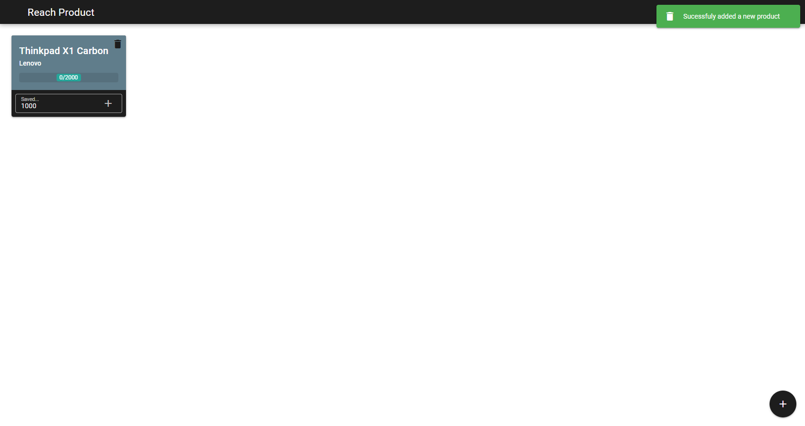
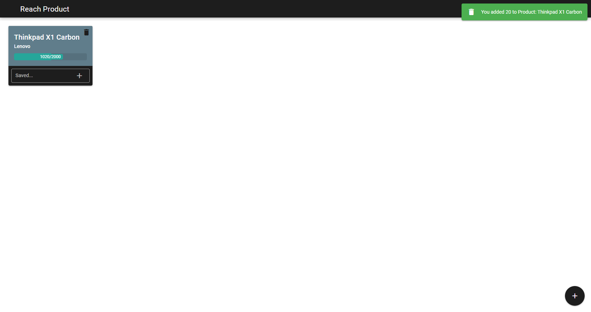
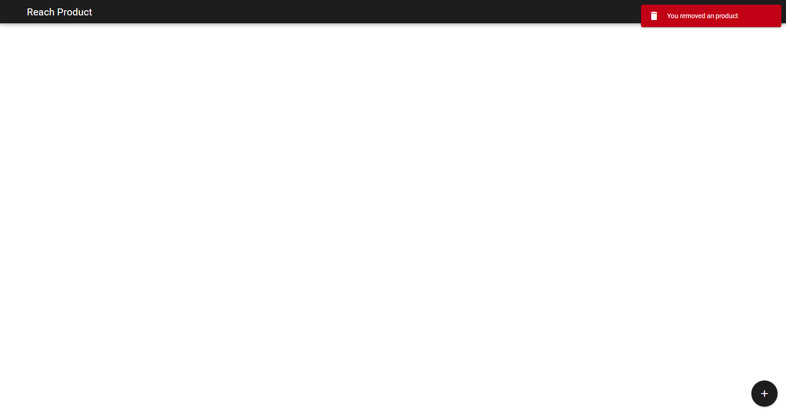

# Reach Product App (Quasar)

Follow your savings for products

## Functionalities
- Add Products
- Update total aquired value of a product
- Remove Product

## Technologies Used
- Quasar
- LocalStorage
- Notify

## Screenshoots
Add product screen



Main screen after add one product



Update total saved of a product



Delete Product



## Install the dependencies
```bash
yarn
```

### Start the app in development mode)
```bash
quasar dev
```

### Lint the files
```bash
yarn run lint
```

### Build the app for production
```bash
quasar build
```
